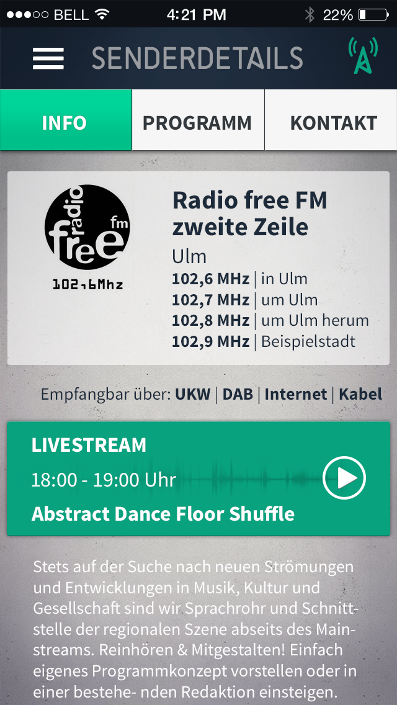

# Freie Radio App

The app is a hybrid app based on "Adobe Phonegap". The App is simply just a website with javascript.
Goal of the App is, to display the program data of all free radios in germany in one App. So you can search with genres the transmissions you like. Also you have the ability to listen to the radios via their internet streams and you can discover new stations with the map. 

[]

## Prerequisites

You need the following tools:
+ Node.js/npm
+ typescript
+ phonegap/cordova
+ Android SDK and or Xcode(for iOS) for testing

Optional you can install or use this tools:
+ cordova tools in VSC -> for faster testing
+ chrome -> for debugging
+ gulp -> to compile typescript 


## Installation

Clone the repository and open the folder in code editor of choice.

To install phonegap type into the terminal:
 
```
npm install -g phonegap
```
To install gulp:

```gulp
npm install gulp -D
```

## Workflow
+ Make your changes in typescript,php or CSS
+ Compile with gulp

To run on Android:
+ Connect Connect a Device or start an Emulator
+ Cordova run Android or use the plugin


### Compile with typescript
```gulp
gulp typescript
```


## Contributing
Pull requests are welcome. For major changes, please open an issue first to discuss what you would like to change.

Please make sure to update tests as appropriate.

## The format from the stations

meta.xml 
provides links to station- and program.xml of broadcasting stations participating at Freie Radio App

station-v3.xml
latest template for xml which provides station- and program-data of broadcasting stations participating at Freie Radio App

station-v4.xml 
next generation template, not used so far

## Further information
For further information got to [wiki page](https://github.com/FreieRadios/freieradioapp/wiki). Editors are welcome. Fetching like git is possible.

## License
[GPLv3](https://choosealicense.com/licenses/gpl-3.0/)
